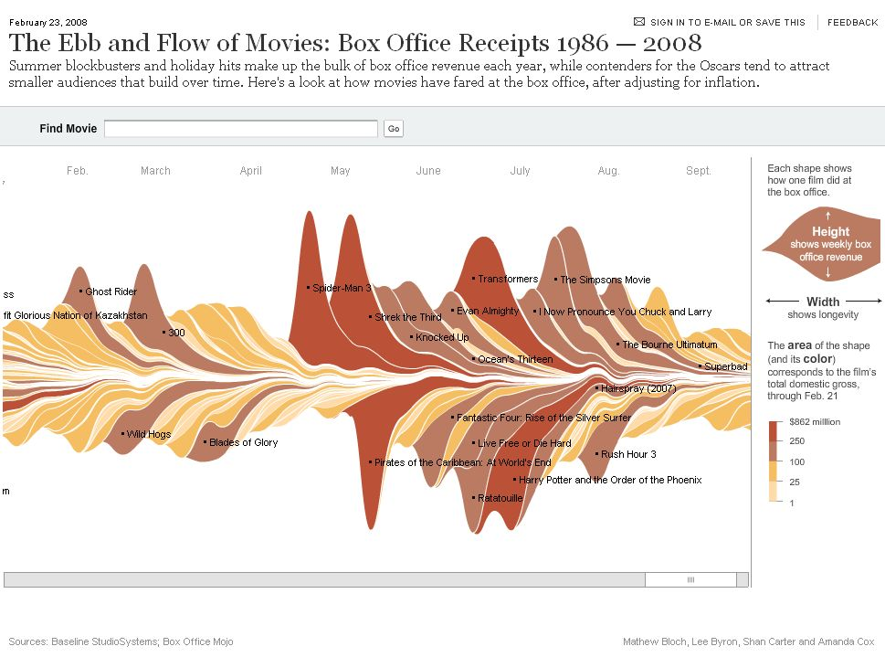
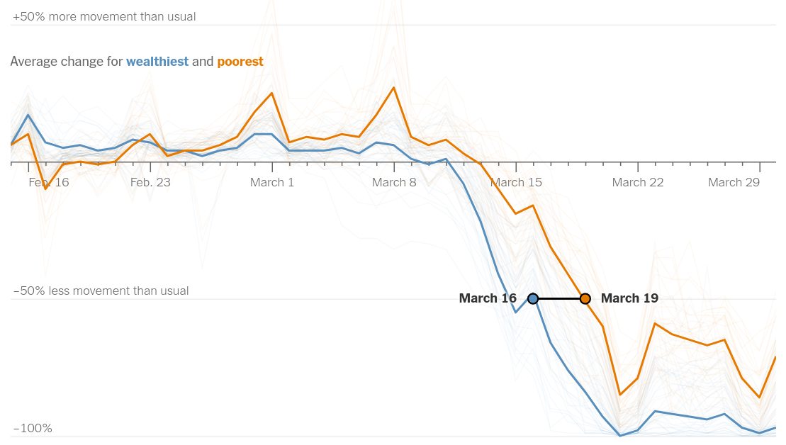

```{r figure-size, include = FALSE}
knitr::opts_chunk$set(
  fig.width = 960/72, fig.height = 640/72, dpi = 72,
  cache = TRUE
)
```

```{r browser, include = FALSE}
op <- options(browser = "xdg-open")
```

```{r library}
suppressPackageStartupMessages(library(tidyverse))
library(googlesheets4)
library(streamgraph)
library(ggTimeSeries)
library(ggrepel)
library(viridis)
library(cowplot)
suppressPackageStartupMessages(library(BreakoutDetection))
library(RColorBrewer)
library(lubridate)
library(here)
```

## Background

People submit feedback to GOV.UK, which we analyse for top terms, and then
tell people about.  One idea is to visualise the top n terms changing over time.

## Ideas

### Streamgraph

We could do a streamgraph like this one from the [New York
Times](https://stackoverflow.com/questions/13084998/streamgraphs-in-r).

[](https://stackoverflow.com/questions/13084998/streamgraphs-in-r)

To mock this graph, we use the top 10 search terms on GOV.UK over a period,
because the feedback data analysis isn't ready yet.

```{r download-search-data}
search_terms <-
  read_sheet(
    "https://docs.google.com/spreadsheets/d/1OCAE4RyTbl4zzajsxN2opgTwHN7e3tVFFeskeRIprS8/edit?ts=5e8dbcb3#gid=1065327514",
    skip = 6,
    col_types = "ccd"
  ) %>%
  mutate(Date = parse_date(Date, format = "%Y%m%d")) %>%
  rename(term = `Search Term`, date = `Date`, n = `Total Unique Searches`)

range(search_terms$date)
diff(range(search_terms$date))
```

#### Naive ggplot

```{r streamgraph-naive-ggplot}
search_terms %>%
  group_by(date) %>%
  top_n(5, n) %>%
  ungroup() %>%
  ggplot(aes(date, n, fill = term)) +
  geom_area(position = position_stack())
```

#### ggTimeSeries package

```{r streamgraph-ggTimeSeries}
search_terms %>%
  group_by(date) %>%
  top_n(10, n) %>%
  ungroup() %>%
  ggplot(aes(x = date, y = n, group = term, fill = term)) +
   stat_steamgraph() +
   theme_bw()
```

#### streamgraph package (wraps d3.js)

I think the key here is that streamgraph interpolates between points.

```{r streamgraph-htmlwidget-silhouette, out.width = 960, out.height = 640}
# Number of terms to track each day
n_to_track <- 10

# Top n terms per day
top_n_terms_daily <-
  search_terms %>%
  group_by(date) %>%
  top_n(n_to_track, n) %>%
  ungroup()

# Plot
top_n_terms_daily %>%
  streamgraph("term", "n", "date", scale = "date", interactive = FALSE) %>%
  sg_legend(show=TRUE, label="Search terms: ") %>%
  sg_axis_x(tick_interval = 1, tick_units = "day", tick_format = "%a %d %b") %>%
  sg_fill_tableau("colorblind10")
```

### Line graph

We could do line graphs like this one from the [New York
Times](https://www.nytimes.com/interactive/2020/04/03/us/coronavirus-stay-home-rich-poor.html).

[](https://www.nytimes.com/interactive/2020/04/03/us/coronavirus-stay-home-rich-poor.html)

## Interpolate

The best idea above (the streamgraph package) interpolated between points with a
cardinal spline.  Here is a useful [review of splines in
R](https://bmcmedresmethodol.biomedcentral.com/articles/10.1186/s12874-019-0666-3).
This makes it easier for the eye to follow the individual terms as they change
over time, because their shapes are smoother, less spikey.

Let's use the `stats::spline()` function, because it's good enough.

### Create a generic streamgraph shape to use in a legend

```{r streamgraph-legend, include = FALSE, message = FALSE}
x <- 0:3
y1 <- c(0, 2, 1.5, 1)
y2 <- c(0, -1.5, -2, -1)
y1_spline <- spline(x, y1, n = 50)
y2_spline <- spline(x, y2, n = 50)
df <- bind_rows(x = as_tibble(y1_spline), y = as_tibble(y2_spline), .id = "id")

cividis_rgb <-
  tibble(viridisLite::viridis.map) %>%
  filter(opt == "E") %>%
  slice(25) %>%
  {rgb(.$R, .$G, .$B)}

df %>%
  ggplot(aes(x, y, group = id)) +
  geom_area(fill = cividis_rgb) +
  theme_void() +
  theme(
        rect = element_rect(fill = "transparent")
    # panel.background = element_rect(fill = "transparent"), # bg of the panel
    # plot.background = element_rect(fill = "transparent", color = NA), # bg of the plot
    # panel.grid.major = element_blank(), # get rid of major grid
    # panel.grid.minor = element_blank(), # get rid of minor grid
    # legend.background = element_rect(fill = "transparent"), # get rid of legend bg
    # legend.box.background = element_rect(fill = "transparent") # get rid of legend panel bg
  )

ggsave(here("img", "streamgraph-shape.png"), bg = "transparent")
```

### Draw a streamgraph

1. Choose which terms to plot.  I choose any term that has appeared among the
   top n on any day.  `n = 3` seems to be suitable.  So unless a term has broken
   into the top 3 on at least one day, it won't be plotted at all.  This is to
   keep the chart uncluttered, and to make labelling easier.  An alternative
   would be to plot every term, and only label the prominent ones.
2. Interpolate between data points using a smoothing function (a spline in this
   case).  This makes it easier for the eye to track the progress of each term.
   The ggplot2 package supports smoothers, e.g. `geom_smooth()`, but I couldn't
   get them to work for a stacked area plot.
3. Put some terms below the x-axis, which makes it easier to for the eye to see
   terms at once, because their shapes are more distinctive.  Otherwise, with
   many terms plotted above the y-axis, most of the terms will have narrow
   shapes, which are difficult to distinguish from one another.  Terms that are
   perennial favourites are kept close to the x-axis, so that it's easier for
   the eye to ignore them, and focus instead on the breakout terms that appear
   at the edges.
4. Colour each term by the total number of searchs for that term.  This means
   every term has a slightly different colour, which makes it easier to
   distinguish from other terms.  We also tried using colours that weren't
   mapped to any value, but that looked garish and was confusing beause people
   tried to interpret the meaning of the colours.
5. Mark the beginning and end of weekends by vertical dotted lines.
6. Label each term at its widest point.  The {ggrepel} package is used to avoid
   overlapping labels.  The positions of the labels has to be calculated before
   plotting, because I couldn't find a package that can label a stacked area
   plot (which this is).
7. Paste in a generic legend, which was made with Google Draw.

```{r streamgraph-ggplot-both-sides, fig.width = 960/72, fig.height = 640/72, echo = FALSE, message = FALSE}
# Number of terms to track each day
n_to_track <- 3

# Whether to use both sides of the x-axis
both_sides <- TRUE

both_sides <- ifelse(both_sides, -1, 1)

search_terms_dttm <-
  search_terms %>%
  mutate(dttm = as.POSIXct(date)) %>%
  select(-date)

dttm_range <- range(search_terms_dttm$dttm)
dttms <- seq(dttm_range[1], dttm_range[2], by = "1 hour")
dttms_complete <- seq(dttm_range[1], dttm_range[2], by = "1 day")

# Filter for terms that ever appear among the top n of any day
top_n_terms_daily <-
  search_terms_dttm %>%
  group_by(dttm) %>%
  top_n(n_to_track, n) %>%
  ungroup()

# Take those top terms, and retrieve all the data for them, even for days when
# they weren't among the top n.
top_n_terms_all_observations <-
  top_n_terms_daily %>%
  distinct(term) %>%
  inner_join(search_terms_dttm, by = "term") %>%
  complete(term, dttm = dttms_complete, fill = list(n = 0))

terms_colours <-
  top_n_terms_all_observations %>%
  group_by(term) %>%
  filter(n > 0) %>%
  summarise(first_dttm = min(dttm),
            sum_n = sum(n)) %>%
  arrange(term) %>%
  mutate(colour = rep_len(brewer.pal(8, "Dark2"), n())) %>%
  arrange(desc(first_dttm), # breakout terms will appear at the edge
          sum_n) %>% # old, long-running terms will be close to the origin
  mutate(term = as_factor(term),
         scale = rep_len(c(1, both_sides), n()))

interpolations <-
  top_n_terms_all_observations %>%
  nest(data = -term) %>%
  transmute(term, spline_fun = map(data, ~ splinefun(.x$dttm, .x$n))) %>%
  crossing(dttm = list(dttms)) %>%
  transmute(term, dttm, n = map2(spline_fun, dttm, ~ .x(.y))) %>%
  unnest(c(dttm, n)) %>%
  mutate(n = pmax(n, 0)) %>%
  mutate(term = factor(term, levels = levels(terms_colours$term))) %>%
  inner_join(terms_colours, by = "term") %>%
  arrange(desc(term))

# How much space there is between this term and the x-axis a given day.  This
# is to position the labels.  E.g. if there are two other terms closer to the
# x-axis, their `n` will determine how high the label needs to be.  It also has
# to account for terms positioned below the x-axis.
n_below_term <- function(term, dttm) {
  scale <-
    interpolations %>%
    filter(term == {{term}}) %>%
    distinct(scale) %>%
    pull(scale)
  interpolations %>%
    filter(scale == {{scale}},
           as.integer(term) > as.integer({{term}}),
           dttm == {{dttm}}) %>%
    pull(n) %>%
    sum()
}

# Label the each term once, in the place where it is widest.
annotations <-
  interpolations %>%
  group_by(term) %>%
  top_n(1, n) %>% # Where the shape for the term is at its widest
  ungroup() %>%
  mutate(n = n / 2 + map2_dbl(term, dttm, n_below_term), # Half way between the
         # bottom and the top of the stream for this term at this point
         n = scale * n) %>% # `scale ` positions the annotation below the x-axis
                            # if necessary
  select(term, dttm, n)

weekend_breaks <- function(x) {
  mondays <- scales::fullseq(x, "1 week")
  saturdays <- mondays - lubridate::days(2)
  sort(c(mondays, saturdays))
}

p <-
  interpolations %>%
  mutate(n = n * scale)%>%
  ggplot(aes(dttm, n)) +
  geom_area(aes(group = term, fill = sum_n), colour = "white") +
  scale_fill_viridis_c(name = "", # "Total number\nof searches",
                       option = "cividis",
                       trans = "log10",
                       labels = scales::comma) +
  # geom_point(data = annotations, colour = "black", size = 2.5) +
  # geom_point(data = annotations, colour = "white", size = 1) +
  geom_hline(yintercept = 0, colour = "white") +
  geom_label_repel(data = annotations, mapping = aes(label = term),
                   segment.colour = "white",
                   segment.size = 1,
                   min.segment.length = 0,
                   hjust = 0) +
  scale_x_datetime(breaks = weekend_breaks,
                   date_labels = "%a %d %b",
                   position = "top") +
  coord_cartesian(xlim = c(dttm_range[1], dttm_range[2] - days(1))) +
  theme_minimal() +
  theme(panel.grid.major.y = element_blank(),
        panel.grid.minor.y = element_blank(),
        panel.grid.major.x = element_line(colour = "grey50", linetype = "dashed"),
        panel.grid.minor.x = element_blank(),
        axis.text.x = element_text(hjust = 0),
        axis.ticks.x = element_line(colour = "black"),
        axis.text.y = element_blank(),
        plot.margin = unit(c(0.01, 0.15, 0.01, 0.01), units = "npc")) +
  labs(x = "", y = "", title = "GOV.UK most popular search terms over time") +
  NULL

ggdraw() +
  draw_plot(p) +
  draw_image(here("img", "streamgraph-legend.png"),
             x = 0.86, y = 0.12, width = 0.13, height = 1)

ggsave(here("img", "streamgraph-both.png"))
```

```{r streamgraph-ggplot-one-side, fig.width = 960/72, fig.height = 640/72, echo = FALSE, message = FALSE}
# Number of terms to track each day
n_to_track <- 3

# Whether to use both sides of the x-axis
both_sides <- FALSE

both_sides <- ifelse(both_sides, -1, 1)

search_terms_dttm <-
  search_terms %>%
  mutate(dttm = as.POSIXct(date)) %>%
  select(-date)

dttm_range <- range(search_terms_dttm$dttm)
dttms <- seq(dttm_range[1], dttm_range[2], by = "1 hour")
dttms_complete <- seq(dttm_range[1], dttm_range[2], by = "1 day")

top_n_terms_daily <-
  search_terms_dttm %>%
  group_by(dttm) %>%
  top_n(n_to_track, n) %>%
  ungroup()

top_n_terms_all_observations <-
  top_n_terms_daily %>%
  distinct(term) %>%
  inner_join(search_terms_dttm, by = "term") %>%
  complete(term, dttm = dttms_complete, fill = list(n = 0))

terms_colours <-
  top_n_terms_all_observations %>%
  group_by(term) %>%
  filter(n > 0) %>%
  summarise(first_dttm = min(dttm),
            sum_n = sum(n)) %>%
  arrange(term) %>%
  mutate(colour = rep_len(brewer.pal(8, "Dark2"), n())) %>%
  arrange(desc(first_dttm), # breakout terms will appear at the edge
          sum_n) %>% # old, long-running terms will be close to the origin
  mutate(term = as_factor(term),
         scale = rep_len(c(1, both_sides), n()))

interpolations <-
  top_n_terms_all_observations %>%
  nest(data = -term) %>%
  transmute(term, spline_fun = map(data, ~ splinefun(.x$dttm, .x$n))) %>%
  crossing(dttm = list(dttms)) %>%
  transmute(term, dttm, n = map2(spline_fun, dttm, ~ .x(.y))) %>%
  unnest(c(dttm, n)) %>%
  mutate(n = pmax(n, 0)) %>%
  mutate(term = factor(term, levels = levels(terms_colours$term))) %>%
  inner_join(terms_colours, by = "term") %>%
  arrange(desc(term))

n_below_term <- function(term, dttm) {
  scale <-
    interpolations %>%
    filter(term == {{term}}) %>%
    distinct(scale) %>%
    pull(scale)
  interpolations %>%
    filter(scale == {{scale}},
           as.integer(term) > as.integer({{term}}),
           dttm == {{dttm}}) %>%
    pull(n) %>%
    sum()
}

annotations <-
  interpolations %>%
  group_by(term) %>%
  top_n(1, n) %>%
  ungroup() %>%
  mutate(n = n / 2 + map2_dbl(term, dttm, n_below_term),
         n = scale * n) %>%
  select(term, dttm, n)

weekend_breaks <- function(x) {
  mondays <- scales::fullseq(x, "1 week")
  saturdays <- mondays - lubridate::days(2)
  sort(c(mondays, saturdays))
}

p <-
  interpolations %>%
  mutate(n = n * scale)%>%
  ggplot(aes(dttm, n)) +
  geom_area(aes(group = term, fill = sum_n), colour = "white") +
  scale_fill_viridis_c(name = "", # "Total number\nof searches",
                       option = "cividis",
                       trans = "log10",
                       labels = scales::comma) +
  # geom_point(data = annotations, colour = "black", size = 2.5) +
  # geom_point(data = annotations, colour = "white", size = 1) +
  geom_label_repel(data = annotations, mapping = aes(label = term),
                   segment.colour = "white",
                   segment.size = 1,
                   min.segment.length = 0,
                   hjust = 0) +
  scale_x_datetime(breaks = weekend_breaks,
                   date_labels = "%a %d %b",
                   position = "top") +
  coord_cartesian(xlim = c(dttm_range[1], dttm_range[2] - days(1))) +
  theme_minimal() +
  theme(panel.grid.major.y = element_blank(),
        panel.grid.minor.y = element_blank(),
        panel.grid.major.x = element_line(colour = "grey50", linetype = "dashed"),
        panel.grid.minor.x = element_blank(),
        axis.text.x = element_text(hjust = 0),
        axis.ticks.x = element_line(colour = "black"),
        axis.text.y = element_blank(),
        plot.margin = unit(c(0.26, 0.15, 0.26, 0.01), units = "npc")) +
  labs(x = "", y = "", title = "GOV.UK most popular search terms over time") +
  NULL

ggdraw() +
  draw_plot(p) +
  draw_image(here("img", "streamgraph-legend.png"),
             x = 0.82, y = 0, width = 0.2, height = 1, scale = .6)

ggsave(here("img", "streamgraph-one-side.png"))
```

### Top n terms over the whole period

```{r streamgraph-ggplot-long-run-top-n, fig.width = 960/72, fig.height = 640/72, echo = FALSE, message = FALSE}
# Number of terms to track over the whole period
n_to_track <- 5

# Whether to use both sides of the x-axis
both_sides <- FALSE

both_sides <- ifelse(both_sides, -1, 1)

search_terms_dttm <-
  search_terms %>%
  mutate(dttm = as.POSIXct(date)) %>%
  select(-date)

dttm_range <- range(search_terms_dttm$dttm)
dttms <- seq(dttm_range[1], dttm_range[2], by = "1 hour")
dttms_complete <- seq(dttm_range[1], dttm_range[2], by = "1 day")

top_n_terms_period <-
  search_terms_dttm %>%
  count(term, wt = n) %>%
  top_n(n_to_track, wt = n) %>%
  select(-n) %>%
  inner_join(search_terms_dttm, by = "term")

terms_colours <-
  top_n_terms_period  %>%
  group_by(term) %>%
  filter(n > 0) %>%
  summarise(first_dttm = min(dttm),
            sum_n = sum(n)) %>%
  arrange(term) %>%
  mutate(colour = rep_len(brewer.pal(8, "Dark2"), n())) %>%
  arrange(desc(first_dttm), # breakout terms will appear at the edge
          sum_n) %>% # old, long-running terms will be close to the origin
  mutate(term = as_factor(term),
         scale = rep_len(c(1, both_sides), n()))

interpolations <-
  top_n_terms_period %>%
  nest(data = -term) %>%
  transmute(term, spline_fun = map(data, ~ splinefun(.x$dttm, .x$n))) %>%
  crossing(dttm = list(dttms)) %>%
  transmute(term, dttm, n = map2(spline_fun, dttm, ~ .x(.y))) %>%
  unnest(c(dttm, n)) %>%
  mutate(n = pmax(n, 0)) %>%
  mutate(term = factor(term, levels = levels(terms_colours$term))) %>%
  inner_join(terms_colours, by = "term") %>%
  arrange(desc(term))

n_below_term <- function(term, dttm) {
  scale <-
    interpolations %>%
    filter(term == {{term}}) %>%
    distinct(scale) %>%
    pull(scale)
  interpolations %>%
    filter(scale == {{scale}},
           as.integer(term) > as.integer({{term}}),
           dttm == {{dttm}}) %>%
    pull(n) %>%
    sum()
}

annotations <-
  interpolations %>%
  group_by(term) %>%
  top_n(1, n) %>%
  ungroup() %>%
  mutate(n = n / 2 + map2_dbl(term, dttm, n_below_term),
         n = scale * n) %>%
  select(term, dttm, n)

weekend_breaks <- function(x) {
  mondays <- scales::fullseq(x, "1 week")
  saturdays <- mondays - lubridate::days(2)
  sort(c(mondays, saturdays))
}

p <-
  interpolations %>%
  mutate(n = n * scale)%>%
  ggplot(aes(dttm, n)) +
  geom_area(aes(group = term, fill = sum_n), colour = "white") +
  scale_fill_viridis_c(name = "", # "Total number\nof searches",
                       option = "cividis",
                       trans = "log10",
                       labels = scales::comma) +
  # geom_point(data = annotations, colour = "black", size = 2.5) +
  # geom_point(data = annotations, colour = "white", size = 1) +
  geom_label_repel(data = annotations, mapping = aes(label = term),
                   segment.colour = "white",
                   segment.size = 1,
                   min.segment.length = 0,
                   hjust = 0) +
  scale_x_datetime(breaks = weekend_breaks,
                   date_labels = "%a %d %b",
                   position = "top") +
  coord_cartesian(xlim = c(dttm_range[1], dttm_range[2] - days(1))) +
  theme_minimal() +
  theme(panel.grid.major.y = element_blank(),
        panel.grid.minor.y = element_blank(),
        panel.grid.major.x = element_line(colour = "grey50", linetype = "dashed"),
        panel.grid.minor.x = element_blank(),
        axis.text.x = element_text(hjust = 0),
        axis.ticks.x = element_line(colour = "black"),
        axis.text.y = element_blank(),
        plot.margin = unit(c(0.26, 0.15, 0.26, 0.01), units = "npc")) +
  labs(x = "", y = "", title = "GOV.UK long-run most popular search terms") +
  NULL

ggdraw() +
  draw_plot(p) +
  draw_image(here("img", "streamgraph-legend.png"),
             x = 0.82, y = 0, width = 0.2, height = 1, scale = .6)

ggsave(here("img", "streamgraph-long-run-top-n.png"))
```

### Daily trending terms, excluding the overall top n

```{r streamgraph-ggplot-daily-trending, fig.width = 960/72, fig.height = 640/72, echo = FALSE, message = FALSE}

# Overall top n to exclude
n_to_exclude <- 5

# Daily top n terms to include
n_to_track <- 2

# Whether to use both sides of the x-axis
both_sides <- TRUE

both_sides <- ifelse(both_sides, -1, 1)

search_terms_dttm <-
  search_terms %>%
  mutate(dttm = as.POSIXct(date)) %>%
  select(-date)

dttm_range <- range(search_terms_dttm$dttm)
dttms <- seq(dttm_range[1], dttm_range[2], by = "1 hour")
dttms_complete <- seq(dttm_range[1], dttm_range[2], by = "1 day")

top_n_terms_period <-
  search_terms_dttm %>%
  count(term, wt = n) %>%
  top_n(n_to_exclude, wt = n) %>%
  select(-n)

top_n_terms_daily <-
  search_terms_dttm %>%
  anti_join(top_n_terms_period, by = "term") %>%
  group_by(dttm) %>%
  top_n(n_to_track, n) %>%
  ungroup()

top_n_terms_all_observations <-
  top_n_terms_daily %>%
  distinct(term) %>%
  inner_join(search_terms_dttm, by = "term") %>%
  complete(term, dttm = dttms_complete, fill = list(n = 0))

terms_colours <-
  top_n_terms_all_observations %>%
  group_by(term) %>%
  filter(n > 0) %>%
  summarise(first_dttm = min(dttm),
            sum_n = sum(n)) %>%
  arrange(term) %>%
  mutate(colour = rep_len(brewer.pal(8, "Dark2"), n())) %>%
  arrange(desc(first_dttm), # breakout terms will appear at the edge
          sum_n) %>% # old, long-running terms will be close to the origin
  mutate(term = as_factor(term),
         scale = rep_len(c(1, both_sides), n()))

interpolations <-
  top_n_terms_all_observations %>%
  nest(data = -term) %>%
  transmute(term, spline_fun = map(data, ~ splinefun(.x$dttm, .x$n))) %>%
  crossing(dttm = list(dttms)) %>%
  transmute(term, dttm, n = map2(spline_fun, dttm, ~ .x(.y))) %>%
  unnest(c(dttm, n)) %>%
  mutate(n = pmax(n, 0)) %>%
  mutate(term = factor(term, levels = levels(terms_colours$term))) %>%
  inner_join(terms_colours, by = "term") %>%
  arrange(desc(term))

n_below_term <- function(term, dttm) {
  scale <-
    interpolations %>%
    filter(term == {{term}}) %>%
    distinct(scale) %>%
    pull(scale)
  interpolations %>%
    filter(scale == {{scale}},
           as.integer(term) > as.integer({{term}}),
           dttm == {{dttm}}) %>%
    pull(n) %>%
    sum()
}

annotations <-
  interpolations %>%
  group_by(term) %>%
  top_n(1, n) %>%
  ungroup() %>%
  mutate(n = n / 2 + map2_dbl(term, dttm, n_below_term),
         n = scale * n) %>%
  select(term, dttm, n)

weekend_breaks <- function(x) {
  mondays <- scales::fullseq(x, "1 week")
  saturdays <- mondays - lubridate::days(2)
  sort(c(mondays, saturdays))
}

p <-
  interpolations %>%
  mutate(n = n * scale)%>%
  ggplot(aes(dttm, n)) +
  geom_area(aes(group = term, fill = sum_n), colour = "white") +
  scale_fill_viridis_c(name = "", # "Total number\nof searches",
                       option = "cividis",
                       trans = "log10",
                       labels = scales::comma) +
  # geom_point(data = annotations, colour = "black", size = 2.5) +
  # geom_point(data = annotations, colour = "white", size = 1) +
  geom_hline(yintercept = 0, colour = "white") +
  geom_label_repel(data = annotations, mapping = aes(label = term),
                   segment.colour = "white",
                   segment.size = 1,
                   min.segment.length = 0,
                   hjust = 0) +
  scale_x_datetime(breaks = weekend_breaks,
                   date_labels = "%a %d %b",
                   position = "top") +
  coord_cartesian(xlim = c(dttm_range[1], dttm_range[2] - days(1))) +
  theme_minimal() +
  theme(panel.grid.major.y = element_blank(),
        panel.grid.minor.y = element_blank(),
        panel.grid.major.x = element_line(colour = "grey50", linetype = "dashed"),
        panel.grid.minor.x = element_blank(),
        axis.text.x = element_text(hjust = 0),
        axis.ticks.x = element_line(colour = "black"),
        axis.text.y = element_blank(),
        plot.margin = unit(c(0.01, 0.15, 0.01, 0.01), units = "npc")) +
  labs(x = "", y = "", title = "GOV.UK daily trending search terms",
       subtitle = "Excluding the long-run most-popular search terms") +
  NULL

ggdraw() +
  draw_plot(p) +
  draw_image(here("img", "streamgraph-legend.png"),
             x = 0.86, y = 0.12, width = 0.13, height = 1)

ggsave(here("img", "streamgraph-daily-trending.png"))
```

## Breakout detection

Identify statistically significant breakout points in the search terms.  This
might be useful for visualisation, to choose which series to show, or to avoid
showing insignificant fluctuations.  It didn't really work though on default
settings, and fine-tuning should be a separate project.  The default settings
assumed much more data, and in general I think the {BreakoutDetection} needs
more data points, e.g. hourly.  Other methods are demonstrated in these
[slides](https://docs.google.com/presentation/d/1WEH5p1TalWCoBWbGDDvboEdMpo8hZgN5iSHl2cFdM8M/edit?usp=sharing).

```{r breakout-detection}
search_terms_complete <-
  search_terms %>%
  complete(term,
           date = seq(min(date), max(date), by = "1 day"),
           fill = list(n = 0))

breakouts <-
  search_terms_complete  %>%
  nest(data = -term) %>%
  mutate(breakouts = map(data, ~ breakout(.x$n, min.size = 2)))

breakouts %>%
  unnest_wider(breakouts) %>%
  filter(loc != 0) %>%
  top_n(-10, wt = stat) %>%
  select(term, data) %>%
  unnest(data) %>%
  ggplot(aes(date, n, group = term, colour = term)) +
  geom_line()

breakouts$breakouts[[2]]

search_terms_complete  %>%
  filter(term == "alcohol") %>%
  pull(n) %>%
  breakout(min.size = 2, plot = TRUE)
```

## Just write it in words?

> Trending terms by day:
>
> * Today: "self-assessment", "sign-in", "tax"
> * Yesterday: "self-assessment", "sign-in", "tax"
> * Last week: "marriage tax", "sorn"
> * last weekend: "alcohol", "coronavirus extremely vulnerable"
>
> Most popular terms overall:
>
> * "universal credit"
> * "furlough"
> * "vulnerable"
> * "self employed"
> * "mot"
